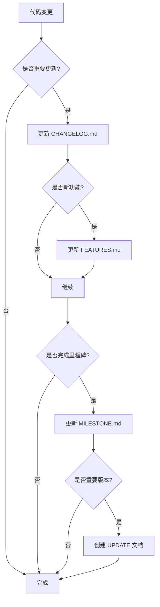

# 文档结构说明

本文档说明 Memo 项目的文档组织结构。

## 📂 文档目录结构

```
memo/
├── README.md                           # 项目主页（保留在根目录）
│
├── docs/                               # 所有项目文档
│   ├── README.md                       # 文档索引和导航
│   │
│   ├── 项目管理文档/
│   │   ├── MILESTONE.md               # 开发里程碑和版本规划
│   │   ├── CHANGELOG.md               # 版本更新日志
│   │   └── FEATURES.md                # 功能特性和使用指南
│   │
│   ├── 技术文档/
│   │   ├── DESIGN.md                  # UI/UX 设计规范
│   │   └── IMPLEMENTATION_PLAN.md     # 技术实现计划
│   │
│   ├── 环境配置文档/
│   │   ├── FLUTTER_ENV_SETUP.md       # Flutter 环境配置
│   │   └── GIT_SETUP.md               # Git 配置和规范
│   │
│   ├── 版本更新文档/
│   │   └── UPDATE_2025-11-09.md       # 特定版本的详细更新说明
│   │
│   ├── DOCS_STRUCTURE.md              # 本文件 - 文档结构说明
│   └── ...                            # 其他文档
│
├── setup_flutter_env.ps1              # Flutter 环境设置脚本
├── setup_flutter_env.bat              # Flutter 环境设置脚本 (批处理)
└── setup_git.ps1                      # Git 设置脚本
```

## 📋 文档分类

### 1️⃣ 项目管理文档
用于项目规划、进度跟踪和功能说明。

| 文档 | 用途 | 更新频率 |
|------|------|---------|
| `MILESTONE.md` | 版本规划、开发阶段、完成情况 | 里程碑完成时 |
| `CHANGELOG.md` | 版本更新历史、功能变更记录 | 每次更新时 |
| `FEATURES.md` | 详细功能说明、使用指南 | 新功能添加时 |

### 2️⃣ 技术文档
用于开发参考和技术规范。

| 文档 | 用途 | 更新频率 |
|------|------|---------|
| `DESIGN.md` | UI/UX 设计规范、组件标准 | 设计变更时 |
| `IMPLEMENTATION_PLAN.md` | 技术架构、数据库设计、API 规范 | 架构调整时 |

### 3️⃣ 环境配置文档
用于开发环境搭建和团队协作规范。

| 文档 | 用途 | 更新频率 |
|------|------|---------|
| `FLUTTER_ENV_SETUP.md` | Flutter 环境配置、镜像源设置 | 配置变更时 |
| `GIT_SETUP.md` | Git 提交规范、分支管理 | 规范调整时 |

### 4️⃣ 版本更新文档
用于记录特定版本的详细更新内容。

| 文档 | 用途 | 更新频率 |
|------|------|---------|
| `UPDATE_YYYY-MM-DD.md` | 特定日期的详细更新说明 | 重要更新时 |

## 🎯 文档使用场景

### 场景 1: 新开发者加入
```
1. 阅读 README.md (项目概览)
2. 阅读 docs/FLUTTER_ENV_SETUP.md (配置环境)
3. 阅读 docs/GIT_SETUP.md (了解规范)
4. 阅读 docs/IMPLEMENTATION_PLAN.md (了解架构)
5. 阅读 docs/MILESTONE.md (了解进度)
```

### 场景 2: 了解功能
```
1. 阅读 README.md (功能概览)
2. 阅读 docs/FEATURES.md (详细功能)
3. 阅读 docs/CHANGELOG.md (更新历史)
```

### 场景 3: 进行开发
```
1. 查看 docs/MILESTONE.md (当前任务)
2. 参考 docs/DESIGN.md (设计规范)
3. 参考 docs/IMPLEMENTATION_PLAN.md (技术规范)
4. 更新 docs/CHANGELOG.md (记录变更)
```

### 场景 4: 发布版本
```
1. 更新 docs/CHANGELOG.md (版本更新)
2. 更新 docs/MILESTONE.md (完成进度)
3. 创建 docs/UPDATE_YYYY-MM-DD.md (详细说明)
4. 更新 README.md (版本号)
```

## 📝 文档维护规范

### 命名规范
- **项目文档**: 使用全大写字母 (如 `MILESTONE.md`)
- **版本更新**: `UPDATE_YYYY-MM-DD.md` (如 `UPDATE_2025-11-09.md`)
- **技术规范**: 使用全大写字母和下划线 (如 `API_SPEC.md`)

### 目录规范
- 所有文档必须包含清晰的标题层级 (`#`, `##`, `###`)
- 使用 emoji 标记不同类型的内容（如 ✅ ❌ 🚧 📝）
- 包含"最后更新"时间戳

### 链接规范
- 使用相对路径引用其他文档
- 从 docs 内引用: `./OTHER_DOC.md`
- 从根目录引用: `./docs/OTHER_DOC.md`
- 包含链接描述文字

### 更新规范
- 每次重要更新都应更新相关文档
- 更新文档时要同时更新"最后更新"时间
- 保持文档间的一致性

## 🔄 文档更新流程



## 🌟 文档质量标准

### 必须包含
- ✅ 清晰的标题和层级结构
- ✅ 最后更新时间
- ✅ 内容目录 (对于长文档)
- ✅ 相关链接和引用

### 应该包含
- 📝 示例代码和图表
- 📝 常见问题解答
- 📝 快速导航链接
- 📝 使用场景说明

### 避免
- ❌ 过时的信息
- ❌ 重复的内容
- ❌ 缺少上下文的代码片段
- ❌ 损坏的链接

## 📊 文档完整性检查清单

在发布版本前，检查以下文档是否都已更新：

- [ ] `README.md` - 版本号、功能列表
- [ ] `docs/CHANGELOG.md` - 版本更新记录
- [ ] `docs/MILESTONE.md` - 完成进度
- [ ] `docs/FEATURES.md` - 新增功能说明
- [ ] `docs/DESIGN.md` - 设计变更（如有）
- [ ] `docs/IMPLEMENTATION_PLAN.md` - 技术变更（如有）

## 🔗 相关资源

- [Markdown 语法指南](https://www.markdownguide.org/)
- [Keep a Changelog](https://keepachangelog.com/zh-CN/1.0.0/)
- [语义化版本](https://semver.org/lang/zh-CN/)

---

**最后更新**: 2025-11-09  
**维护者**: Memo 开发团队

